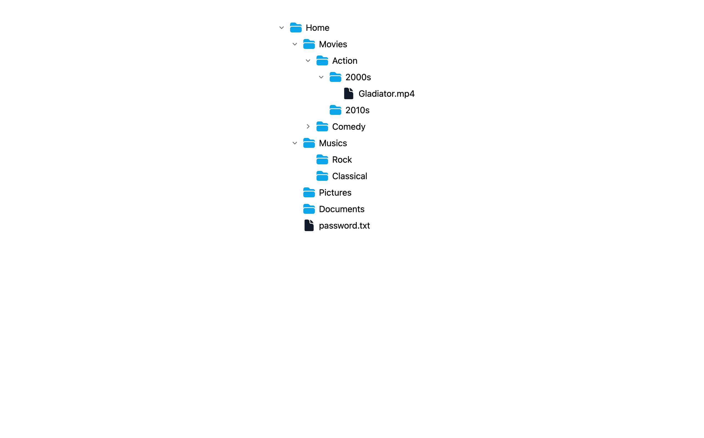

# Folder

> React Recursive Component, which component is rendering itself

  <a href="https://file-system-mia.vercel.app" target="_blank">Demo</a>

## Reference

- [How to build a Recursive React Component](https://youtu.be/6UU2Ey4KZr8?si=rzIiDpm-Brzilzbs)
